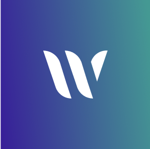

<!--
SPDX-FileCopyrightText: 2025 2025 INDUSTRIA DE DISEÑO TEXTIL S.A. (INDITEX S.A.)

SPDX-License-Identifier: Apache-2.0
-->

<a id="readme-top"></a>

<!-- PROJECT SHIELDS -->

[![Contributors][contributors-shield]][contributors-url]
[![Forks][forks-shield]][forks-url]
[![Stargazers][stars-shield]][stars-url]
[![Issues][issues-shield]][issues-url]
[![project_license][license-shield]][license-url]

<!-- PROJECT LOGO -->
<br />
<div align="center">
  <a href="https://github.com/InditexTech/weavejs">
    <picture>
      <source media="(prefers-color-scheme: dark)" srcset="images/logo.png">
      
    </picture>
  </a>

<h3 align="center">Weave.js</h3>

  <p align="center">
    Free, open source library to build real-time collaboration applications like whiteboards, <br /> diagram editors, etc. on HTML5 Canvas with your own UI!
    <br />
    <a href="https://inditextech.github.io/weavejs/docs/main"><strong>Explore the docs »</strong></a>
    <br />
    <br />
    <a href="https://weavejs.cloud.inditex.com/">View Demo</a>
    &middot;
    <a href="https://github.com/InditexTech/weavejs/issues/new?labels=bug&template=bug-report.md">Report Bug</a>
    &middot;
    <a href="https://github.com/InditexTech/weavejs/issues/new?labels=enhancement&template=feature-request.md">Request Feature</a>
  </p>
</div>

## About The Project

[![Weave.js Screen Shot][product-screenshot]](images/screenshot.png)

Weave.js is a powerful headless framework for building end-to-end collaborative whiteboard applications. Aimed at developers, it provides all the building blocks to develop visual collaborative canvas applications, while handling user interactions to enable real-time collaboration among multiple users.

It provides robust synchronization of a shared-state based on [Yjs][Yjs-url] and [SyncedStore][SyncedStore-url] as well as an extensible API to streamline the development of interactive, collaborative applications. Rendering is handled using [Konva.js][Konva-url] and a custom [React Reconciler][ReactReconciler-url].

### Related repos

- Weave.js [showcase backend](https://github.com/InditexTech/weavejs-backend)
- Weave.js [showcase frontend](https://github.com/InditexTech/weavejs-frontend)

## Prerequisites

- **Node.js:** `18.18.0` or later.
- **Package Manager:** `pnpm` is used in the examples below. `npm` or `yarn` can also be used.
- **React:** `18.2.0` (or `<19.0.0`) is required as a peer dependency.

For a complete understanding of the requirements and detailed setup instructions, please visit the [official documentation](https://inditextech.github.io/weavejs/docs/main/requirements).

## Quickstart

Here’s how to quickly get a sample Weave.js project up and running using `pnpm`. You will be prompted to enter project names.

### 1. Set up the Backend

In your terminal:

```bash
pnpm create weave-backend-app
# Enter your backend project name when prompted (e.g., my-service)
cd [my-service]
pnpm run dev
```

The backend server will start (at `http://localhost:8080`).

### 2. Set up the Frontend

In a new terminal (ensure you are in the same parent directory as your backend project):

```bash
pnpm create weave-frontend-app
# Enter your frontend project name when prompted (e.g., my-app)
cd [my-app]
pnpm run dev
```

The frontend application will start (at `http://localhost:3030`).

Once both the backend and frontend are running, you can open your browser and navigate to `http://localhost:3030` to try out the sample application.

This basic setup uses an Express.js backend with a WebSockets store. For further details, alternative stores, or troubleshooting, please consult the full [quickstart guide][docs-quick-start-url].

## Documentation

If you want to learn more, check our [documentation][docs-url].

Also, don't forget to take a look at the Weave.js [architecture overview][docs-architecture] section for a complete scope of Weave.js and how it works.

## Roadmap

Check out the Weave.js [roadmap][docs-roadmap-url] for details on planned work and the features that will come next.

## Contributing

Contributions are welcome! Please read the [Contributing Guide](CONTRIBUTING.md) for guidelines on how to contribute to this project.

## License

This project is licensed under the terms of the [Apache-2.0](LICENSE) license.

© 2025 INDUSTRIA DE DISEÑO TEXTIL S.A. (INDITEX S.A.)

<p align="right">(<a href="#readme-top">back to top</a>)</p>

[contributors-shield]: https://img.shields.io/github/contributors/InditexTech/weavejs.svg?style=for-the-badge
[contributors-url]: https://github.com/InditexTech/weavejs/graphs/contributors
[forks-shield]: https://img.shields.io/github/forks/InditexTech/weavejs.svg?style=for-the-badge
[forks-url]: https://github.com/InditexTech/weavejs/network/members
[stars-shield]: https://img.shields.io/github/stars/InditexTech/weavejs.svg?style=for-the-badge
[stars-url]: https://github.com/InditexTech/weavejs/stargazers
[issues-shield]: https://img.shields.io/github/issues/InditexTech/weavejs.svg?style=for-the-badge
[docs-url]: https://inditextech.github.io/weavejs
[docs-architecture]: https://inditextech.github.io/weavejs/docs/main/architecture
[docs-quick-start-url]: https://inditextech.github.io/weavejs/docs/main/quickstart
[docs-roadmap-url]: https://inditextech.github.io/weavejs/docs/main/roadmap
[issues-url]: https://github.com/InditexTech/weavejs/issues
[license-shield]: https://img.shields.io/github/license/InditexTech/weavejs.svg?style=for-the-badge
[license-url]: https://github.com/InditexTech/weavejs/blob/master/LICENSE.txt
[product-screenshot]: images/screenshot.png
[Konva-url]: https://github.com/konvajs/konva
[Yjs-url]: https://github.com/yjs/yjs
[SyncedStore-url]: https://github.com/yousefed/SyncedStore
[ReactReconciler-url]: https://github.com/facebook/react/tree/main/packages/react-reconciler
